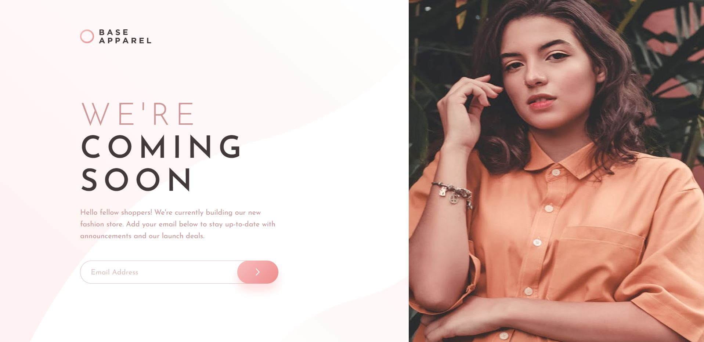

# Frontend Mentor - Base Apparel coming soon page solution

This is a solution to the [Base Apparel coming soon page challenge on Frontend Mentor](https://www.frontendmentor.io/challenges/base-apparel-coming-soon-page-5d46b47f8db8a7063f9331a0).

## Table of contents

- [Overview](#overview)
  - [The challenge](#the-challenge)
  - [Screenshots](#screenshots)
  - [Link](#link)
- [My process](#my-process)
  - [Design](#design)
  - [Development](#development)
  - [Built with](#built-with)
  - [What I learned](#what-i-learned)

## Overview

The challenge was to develop a "Coming Soon" landing page for a forthcoming fashion store. This project was modeled after Frontend Mentor.

The landing page incorporates a logo, images, informative content, and a subscription form. The subscription form validates email inputs upon submission and displays error messages for invalid or empty entries. The form won't submit if the email address is incorrect or empty.

### The challenge

Users should be able to:

- View the optimal layout for the site depending on their device's screen size
- See hover states for all interactive elements on the page
- Receive an error message when the `form` is submitted if:
  - The `input` field is empty
  - The email address is not formatted correctly

### Screenshots

### Link

- Live Site URL: (https://base-apparel-coming-soon-page-pk.netlify.app/)

## My process

### Design

I was provided with a design for this project from Frontend Mentor.

The page layout is mobile-first with a responsive design that scales to larger screen sizes. On mobile view, the content stacks vertically, while on larger screens, elements are arranged optimally for the expanded space.

The design also includes an error state for the subscription form that activates when an incorrect or empty email is submitted.

### Development 

The development process was segmented into two stages:

Initially, the HTML structure was formed and the CSS was developed with a focus on reusability and adaptability.

Following this, the JavaScript functionality was incorporated. This includes a validation function for the subscription form that displays error messages and prevents form submission if an incorrect or empty email is entered.

### Built with

- Semantic HTML5 markup
- CSS custom properties
- CSS Grid
- Mobile-first workflow
- JavaScript 

### What I learned

Throughout this project, I enhanced my skills in JavaScript for email validation and managing error states. The project also provided practical experience with mobile-first design. Handling error states in CSS was a valuable part of the learning process. Overall, it was an effective project for reinforcing my skills with JavaScript, CSS, and HTML.
